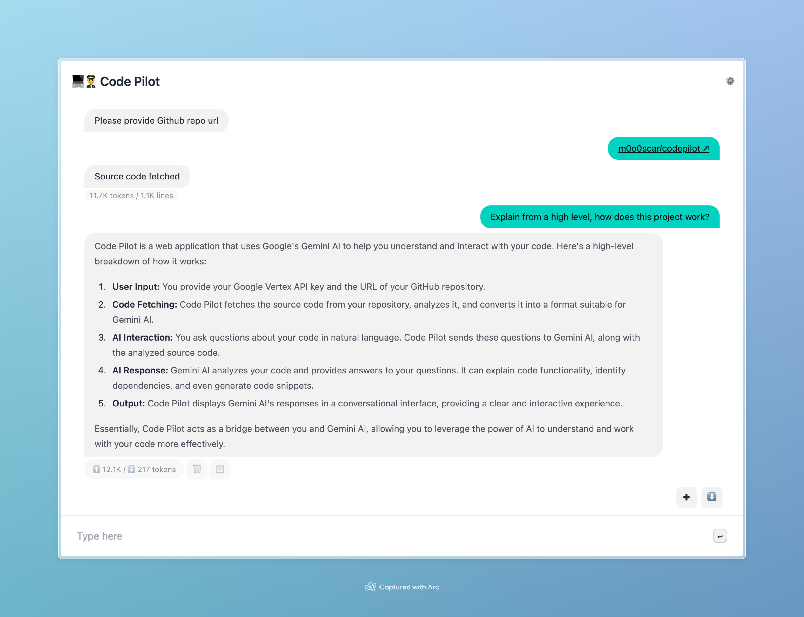

# 💻👨‍✈️ Code Pilot: Your AI-Powered Code Assistant



Code Pilot is a web application that leverages the power of Google's Gemini AI to help you understand and interact with your code. It provides a conversational interface where you can ask questions about your project's source code and receive insightful answers.

## How it Works:

1. **Provide your Google Vertex API key:** This grants access to Google's Gemini AI model.
2. **Input your Github repository URL:** Code Pilot fetches the source code from your repository.
3. **Ask questions about your code:** Use natural language to ask questions about your project's functionality, code structure, or specific functions.
4. **Get AI-powered answers:** Code Pilot uses Gemini AI to analyze your code and provide concise and accurate answers.

## Key Features:

- **Conversational interface:** Ask questions in natural language, just like you would to a human colleague.
- **Code understanding:** Gemini AI analyzes your code to understand its structure, dependencies, and functionality.
- **Contextual answers:** Answers are tailored to the specific code you've provided.
- **Code snippets:** When relevant, Code Pilot provides code snippets to illustrate its answers.
- **History and export:** Save your conversations and export them as Markdown files for easy reference.

## Getting Started:

1. **Install:**
   ```bash
   git clone https://github.com/m0o0scar/codepilot.git
   cd codepilot
   npm i
   npm run dev
   ```
2. **Obtain an API key from Google AI Studio:** [https://aistudio.google.com/app/apikey](https://aistudio.google.com/app/apikey)
3. **Run the application:** Open `http://localhost:3000` in your browser.
4. **Provide your API key and Github repository URL:** Start asking questions!

## Example Usage:

- "Explain the purpose of function xxx."
- "What are the dependencies of this module?"
- "How does this class interact with other classes?"
- "Can you show me an example of how to use this API?"

## Note:

- Code Pilot is still under development and may have limitations.
- The quality of answers depends on the clarity of your questions and the complexity of your code.
- Google Vertex AI usage may incur costs.

We encourage you to explore Code Pilot and see how it can enhance your coding experience :)
